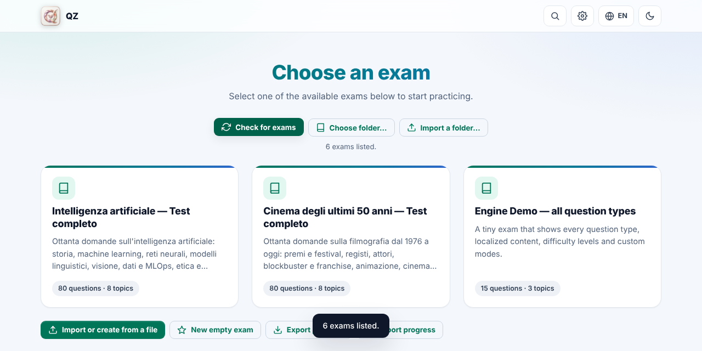
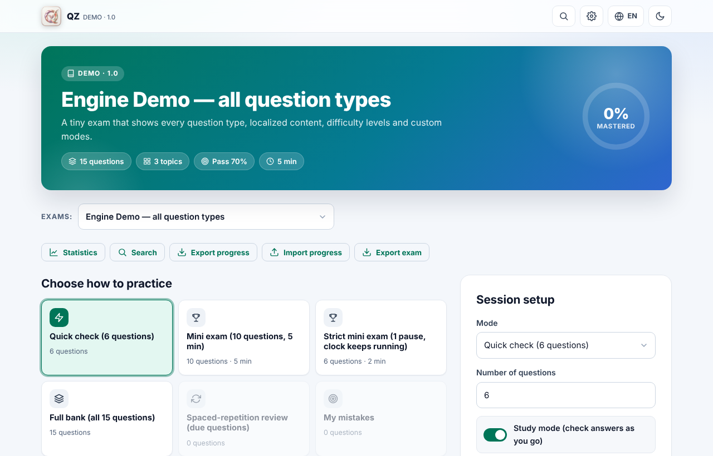
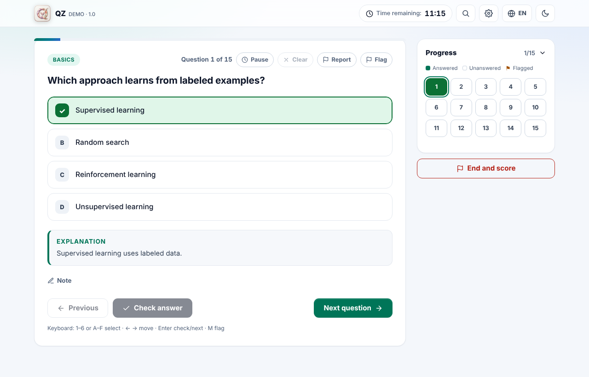
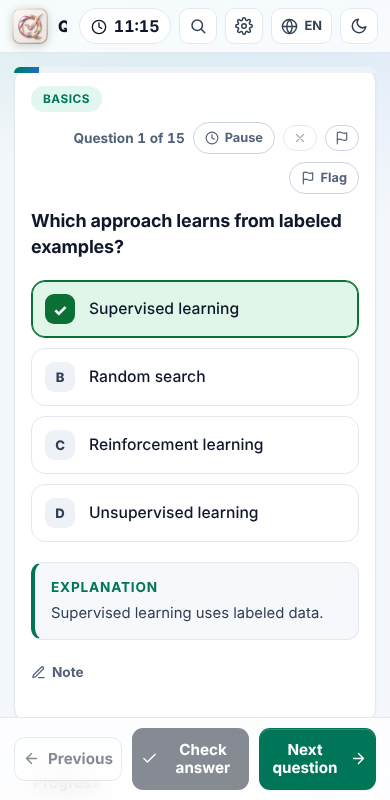

# QZ

**QZ** is a free, open-source practice engine for quizzes and certification exams.
It runs as a **single HTML file** — double-click `exam.html`, no server, no account, no install.
Bring your own questions (one text file per exam) and QZ gives you timed mock exams, study mode, spaced-repetition review, statistics and more.

[](https://buymeacoffee.com/gifwebsolutions) [](LICENSE)

🇮🇹 [Leggi in italiano](README.it.md) · 📘 [User guide](docs/USER-GUIDE.md) · 🧩 [Exam format](docs/EXAM-FORMAT.md) · 🏗️ [Architecture](docs/ARCHITECTURE.md) · 🤝 [Contributing](CONTRIBUTING.md)



---

# Part 1 — The basics

## What is it good for?
- Preparing for a certification (IT, finance, language, driving theory…) with your own question bank.
- Teachers and trainers who want to hand students a ready-to-use quiz that works offline.
- Anyone who wants a private, ad-free place to practise: **your answers never leave your device** unless you decide to sync them.

## Try it in 30 seconds
1. Download the repository (green **Code** button → *Download ZIP*) and unzip it.
2. Double-click **`exam.html`**. Pick the *Engine Demo* exam and press **Start session**.
3. That's it. (Prefer the web? Once GitHub Pages is enabled the app is served at `https://<user>.github.io/<repo>/`.)

| Pick an exam | Study with explanations | Works on phones |
|---|---|---|
|  |  |  |

## What you can do
- **Many ways to practise** — mock exams with a timer, the whole question bank, one topic at a time, the questions you got wrong, flagged questions, unseen questions, and *spaced repetition* that brings back what you are about to forget.
- **Study mode or exam mode** — check each answer at once and read the explanation, or answer freely and review at the end. You can always jump between questions.
- **Every kind of question** — single choice, multiple choice, true/false, ordering, matching, numeric answers and multi-part scenarios, with formatted text, code, tables, formulas and images.
- **Your progress** — score history, accuracy per topic, hardest questions, notes and flags on every question.
- **Your data stays yours** — stored in your browser; optional backup file, transfer code or private GitHub Gist to move between devices.
- **Light and dark theme, English and Italian interface**, keyboard shortcuts and a command palette (`Ctrl/⌘ + K`).
- **Installable and offline** — it can be installed as an app and keeps working without internet.

## Get your own exams into QZ
You have three easy options:
1. **Write a file** — an exam is a plain text file called `something.exam` (see [the format](docs/EXAM-FORMAT.md)). Put it next to `exam.html` and press **Check for exams** on the start page (Chrome/Edge remember the folder).
2. **Import** — use **Import a folder…** or *Options → My exams → Import or create from a file*. QZ understands `.exam`, CSV, Markdown and plain text such as:
   ```
   1. Which protocol resolves names to addresses?
   A) FTP
   B) DNS
   C) SMTP
   Answer: B
   Explanation: DNS maps names to IP addresses.
   ```
   A guided editor shows what was understood and lets you fix problems before saving.
3. **Build it in the editor** — *New empty exam* gives you a form with live validation.

Exams you create in the browser can be exported as `.exam`, CSV, Markdown or **Anki** cards.

## Privacy in one paragraph
QZ has no server and no tracking. Questions, answers, notes and statistics are saved in your browser (IndexedDB). Nothing is uploaded unless you press a sync button yourself. Use *Options → Backup* now and then: clearing your browser data also clears your progress.

---

# Part 2 — In detail

## Practice modes
| Mode | What it does |
|---|---|
| Exam-defined modes | Defined by the exam author: random, *balanced* (one question per topic first) or *weighted* (fixed number per topic group), with their own time limit and pass mark. |
| Full bank / by topic | Every question, or only one topic. |
| Spaced-repetition review | Leitner boxes (intervals 0, 1, 3, 7, 21 days): correct answers move a question up a box, a wrong one sends it back to box 0. |
| My mistakes / Flagged / Unseen | Questions whose last answer was wrong, that you flagged, or never answered. |
| By difficulty | When the exam labels questions easy / medium / hard. |
| Search results | Search the bank (text, topic, type, status) and practise exactly what you found. |

## Realism and scoring (all optional)
- Partial credit for multiple-answer, ordering, matching and scenario questions.
- Negative marking for wrong or unanswered questions (a fraction of the question's points) — the total never goes below zero.
- Per-question weights (`points`) and **mandatory** questions that must be fully right to pass.
- Limited pauses, a *strict clock* that keeps running while the page is closed, a pace indicator, and a printable result (print → *Save as PDF*).
- Timers: total, per question, or none. Navigation between questions is **never** restricted.

## Your data
- **Profiles** — several people or goals on one device, each with separate progress.
- **Storage** — IndexedDB (large quota), with `localStorage`/memory fallbacks; writes happen immediately and again when the page is hidden.
- **Backup** — download a full backup, get a reminder every *N* days, or pick a file (Chrome/Edge) that QZ rewrites after every finished session.
- **Sync between devices** — copy/paste a *transfer code*, or sync through a private GitHub Gist (token kept on your device, never inside backups). Progress is merged, never overwritten.

## Finding exams
The start page is **empty on purpose**: nothing is listed until you press **Check for exams**. On a web address (for example GitHub Pages) the button lists the exams that site offers. From a downloaded `exam.html`, in Chrome/Edge it asks for your exam folder once, remembers it and re-reads it on every press; cards are built from the files themselves. Each new visit starts empty again. In every browser **Import a folder…** copies all `.exam` files of a folder into *My exams*. Unreadable files are listed with the reason. After a browser restart Chrome may ask to allow the folder again — press the button. Files renamed by a phone to `*.exam.txt` are recognised too.

## Exam versions and quality
- Exams can carry a **changelog**: learners see "what's new" when the version changes.
- A question can be revised (`rev` — it returns in review) or **retired** (kept in the file, never asked).
- Learners can **report** a wrong question; reports stay on the device until exported.
- QZ spots weak questions from your own answers: too easy/hard, a suspicious answer key, distractors nobody picks, and structural problems (duplicate options, "all of the above").

## Keyboard
`1–6` or `A–F` choose · `←` `→` move · `Enter` check / next · `M` flag · `X` clear answer · `R` report · `P` pause · `Ctrl/⌘ + K` command palette · `/` search · `?` shortcut help · `Esc` close dialogs.

## For developers
QZ is plain HTML, CSS and JavaScript — no framework, no runtime dependencies. Sources live in `src/` and are bundled into the single `exam.html` by `node tools/build.js`.

```bash
git clone https://github.com/fucc74/ExamSimulator.git && cd ExamSimulator
npm ci                      # dev tools only: Playwright, axe-core, pixelmatch
npm run build               # regenerate exam.html, exams.js, sw.js
npm test                    # unit tests (no browser needed)
npx playwright install chromium && npm run e2e   # browser tests
npm run audit               # accessibility + performance budget
npm run pack                # static site in dist/ (GitHub Pages ready)
```

| Path | What is in it |
|---|---|
| `src/js/` | Numbered modules: engine (`00`–`70`) then UI (`80`–`88`) and start-up (`90`) |
| `src/styles/`, `src/template.html` | Styling and the HTML shell |
| `tools/` | Build, catalog generator, exam validator, legacy converter, packer |
| `tests/` | Unit tests (`node:test`), browser end-to-end tests, audits, visual regression |
| `*.exam` | Exam files — **data**, not code |
| `docs/` | [User guide](docs/USER-GUIDE.md), [exam format](docs/EXAM-FORMAT.md), [API](docs/API.md), [architecture](docs/ARCHITECTURE.md) |

`exam.html`, `exams.js` and `sw.js` are **generated** and committed so the app works straight from a download. CI fails if they are out of date — run `npm run build` before committing.

### Continuous integration and publishing
`.github/workflows/ci.yml` runs on every push and pull request: generated files up to date, unit tests, exam validation, browser tests on Chromium/Firefox/WebKit, mobile emulation, accessibility + performance audit and visual regression.
`.github/workflows/pages.yml` publishes the site to GitHub Pages: in the repository go to *Settings → Pages → Source: GitHub Actions* once, then every push to `main` deploys.
Visual regression needs a baseline made on the machine that checks it: run the CI workflow manually with *update_visual_baseline* ticked, download the `visual-regression` artifact and commit `tests/visual-baseline/`.

### Extending QZ
Events, custom question types and custom study modes are described in [docs/API.md](docs/API.md). New languages: add a dictionary next to `src/js/10-i18n.js` and `11-i18n-v3.js` (a unit test fails if a key is missing).

---

## Contributing
Bug reports, new exams, translations and code are all welcome — see [CONTRIBUTING.md](CONTRIBUTING.md). Good first contributions: a new interface language, a sample exam in your field, an accessibility fix.

## About exam content
Keep exams you do not want to publish in a `private/` folder: it is ignored by git and by the build. Open it with *Check for exams* (Chrome/Edge) to use them locally.

QZ is the engine; exams are separate data files. Whoever shares an exam is responsible for having the right to do so — please do not publish questions copied from copyrighted or confidential material.

## Support the project
QZ is free. If it helps you, you can [buy me a coffee](https://buymeacoffee.com/gifwebsolutions) — a plain link, no tracking. In the app it appears only in calm places (start page footer, results, *Options → About*, command palette), never during a session or in print. Forks can change or remove it: `App.config.supportUrl` in `src/js/00-core.js` (empty = hidden), plus `.github/FUNDING.yml`.

## License
QZ is released under the **GNU General Public License v3.0** — see [LICENSE](LICENSE).
Internal identifiers such as `ExamSim.register(...)` and the `examsim` storage keys keep their original names for backward compatibility with existing exam files and saved progress.
